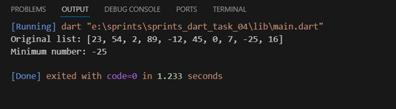

# 🔢 Minimum Number Finder


A simple and efficient Dart program that finds the minimum value from a list of numbers using a loop and comparison operations.

## 📝 Description

This program demonstrates how to find the minimum value in a list of numbers using Dart. It employs a straightforward algorithm that:

1. Takes the first element as initial minimum
2. Compares each subsequent element with current minimum
3. Updates minimum if a smaller value is found

The program showcases basic list manipulation and comparison operations in Dart, making it an excellent example for understanding fundamental programming concepts.

## 💻 Code 

```dart
void main() {
  List<int> numbers = [23, 54, 2, 89, -12, 45, 0, 7, -25, 16];
  print('Original list: $numbers');
  print('Minimum number: ${findMinimum(numbers)}');
}

int findMinimum(List<int> numbers) {
  // consider the first element as the minimum
  int min = numbers[0];
  for (int i = 1; i < numbers.length; i++) {
    if (numbers[i] < min) {
      min = numbers[i];
    }
  }
  return min;
}
```
## 📋 Sample Output

 
